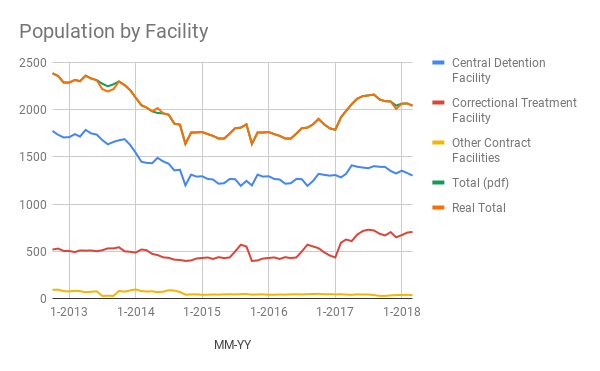

The DOC data originates from their webpage, here:
https://doc.dc.gov/page/inmate-demographics-and-statistics

## QuarterlyPopulationStatistics

The statistics are published quarterly in pdf format and contain monthly totals by facility.
Here we have the data `QuarterlyPopulationStatisticsApril2018.pdf`.
The fields are:
* Central Detention Facility
* Correctional Treatment Facility
* Other Contract Facilities
* Total

I copy-pasted the data into a Google sheet and exported it as the csv attached here.
I also computed the sum of the first 3 columns to check the "Total" on the sheet.
It mostly lines up, but not entirely. Some of the totals differ by as many as 58.

Here is a chart illustrating the data:

Compare to the data included in the original pdf report:

